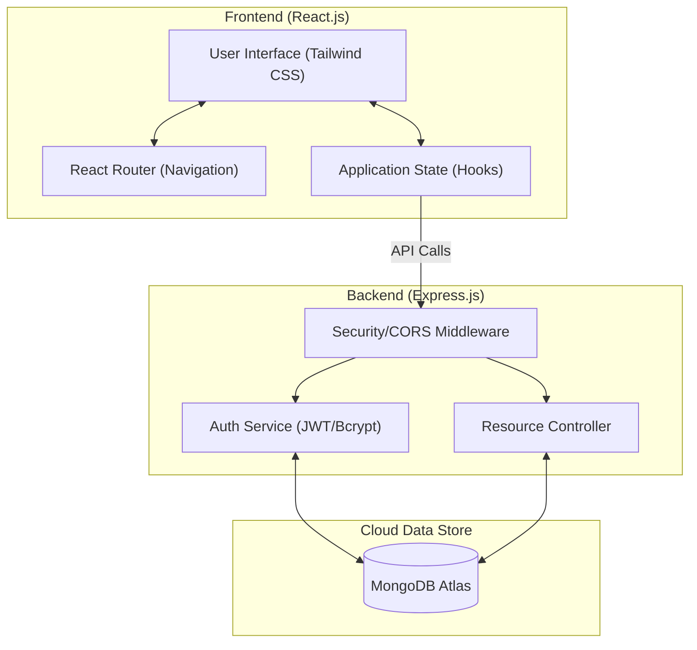
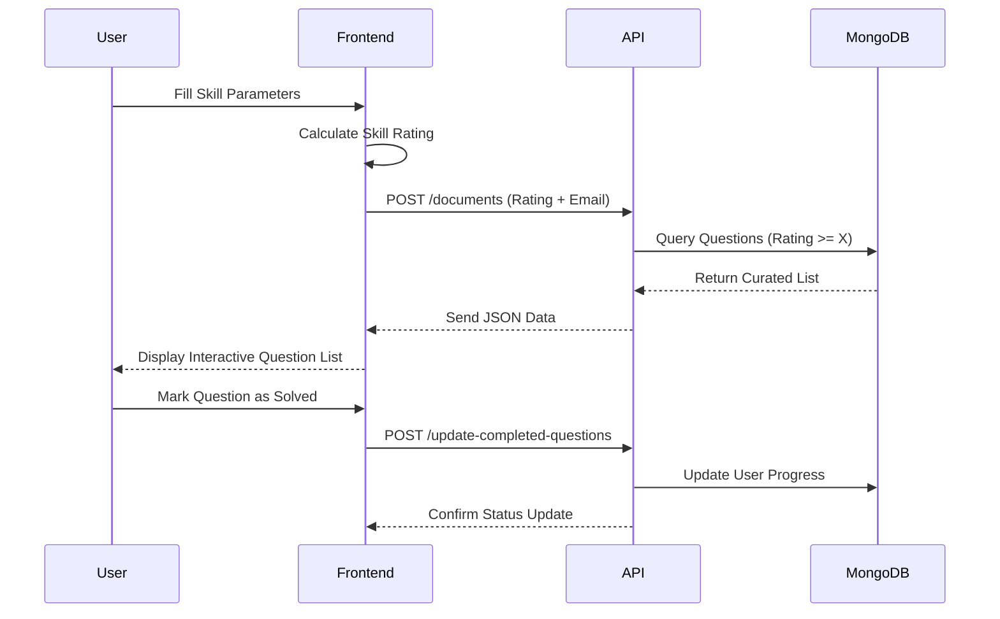

# 🎯 InterviewPrep - DSA Mastery Platform

[](https://opensource.org/licenses/MIT)
[](https://reactjs.org/)
[](https://nodejs.org/)
[](https://www.mongodb.com/atlas)

InterviewPrep is a premium, high-performance platform designed to help developers ace their technical interviews. It features a **Personalized DSA Plan** generator that tailors question lists based on your current skill level, target package, and specific areas of difficulty.

---

## 🏗️ System Architecture

Our platform follows a modern MERN-lite architecture with a focus on modularity, security, and scalability.



---

## 🔄 User Flow Diagram

The core functionality revolves around generating a personalized data structure and algorithm plan.



---

## ✨ Key Features

- **🚀 Personalized Plan Generator**: Intelligent algorithm to calculate your skill level and provide matching questions.
- **🛡️ Secure Authentication**: Robust user management using JWT and Bcrypt for password hashing.
- **📱 Responsive UI**: A premium dark-themed interface built with Tailwind CSS, optimized for both desktop and mobile.
- **☁️ Cloud Hosted Data**: Integrated with MongoDB Atlas for persistent, high-availability storage.
- **🔄 Progress Tracking**: Seamlessly track solved questions and maintain your DSA interview preparation history.

---

## 📂 Project Structure

```text
Interview-Prep/
├── InterviewPrep-Frontend/     # React Application
│   ├── src/
│   │   ├── components/         # Reusable UI (Nav, Footer, etc.)
│   │   ├── pages/              # Main view components
│   │   └── index.css           # Global Theme & Tailwind
│   └── package.json
└── InterviewPrep-Backend/      # Express API
    ├── src/
    │   ├── models/             # Mongoose Schemas (User, Document)
    │   ├── controllers/        # Business Logic
    │   └── routes/             # API Endpoints
    ├── index.js                # Server Entry Point
    └── .env                    # Environment Config
```

---

## 🛠️ Getting Started

### Prerequisites
- Node.js (v16+)
- MongoDB Atlas Account

### Setup Backend
1. `cd InterviewPrep-Backend`
2. `npm install`
3. Create a `.env` file:
   ```env
   MONGO_URI="your_mongodb_atlas_uri"
   JWT_SECRET="your_secret_key"
   ```
4. `npm start`

### Setup Frontend
1. `cd InterviewPrep-Frontend`
2. `npm install`
3. `npm start`

---

## 🤝 Contribution

Contributions are what make the open-source community such an amazing place to learn, inspire, and create. Any contributions you make are **greatly appreciated**.

1. Fork the Project
2. Create your Feature Branch (`git checkout -b feature/AmazingFeature`)
3. Commit your Changes (`git commit -m 'Add some AmazingFeature'`)
4. Push to the Branch (`git push origin feature/AmazingFeature`)
5. Open a Pull Request

---

*Made with ❤️ by the InterviewPrep Team*
