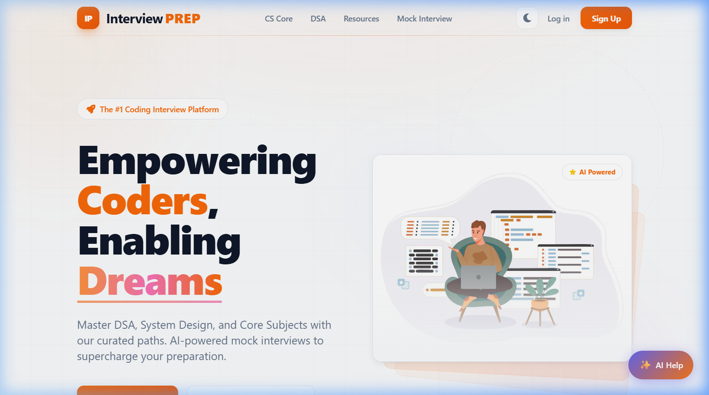
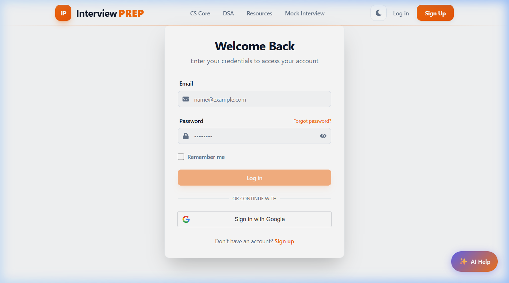
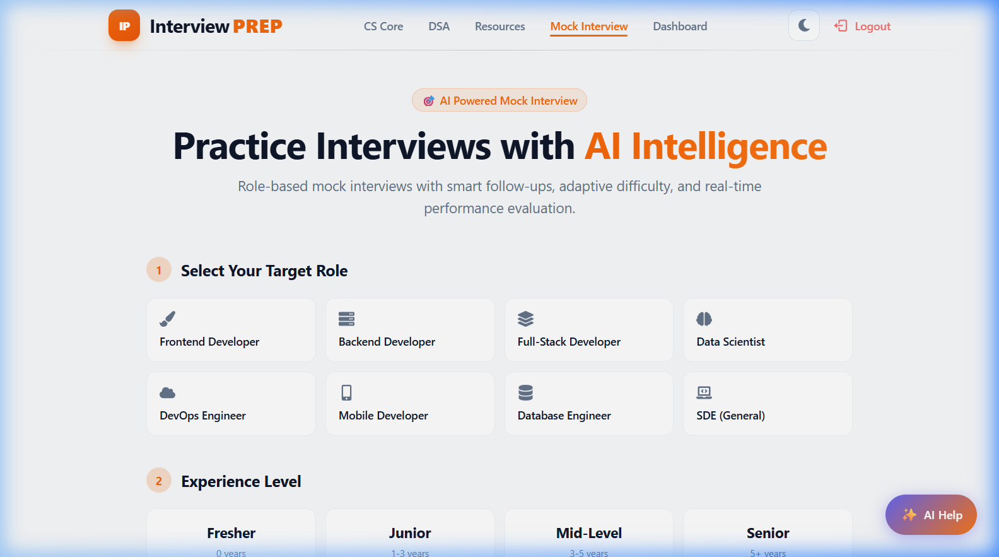
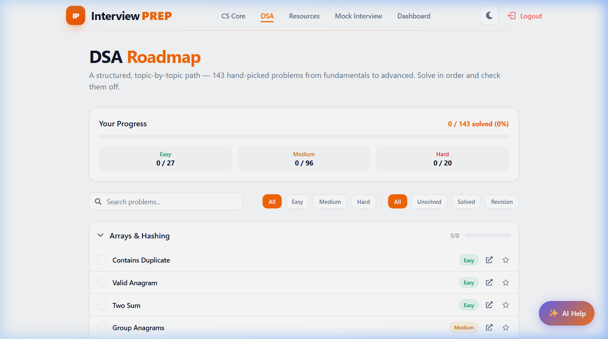
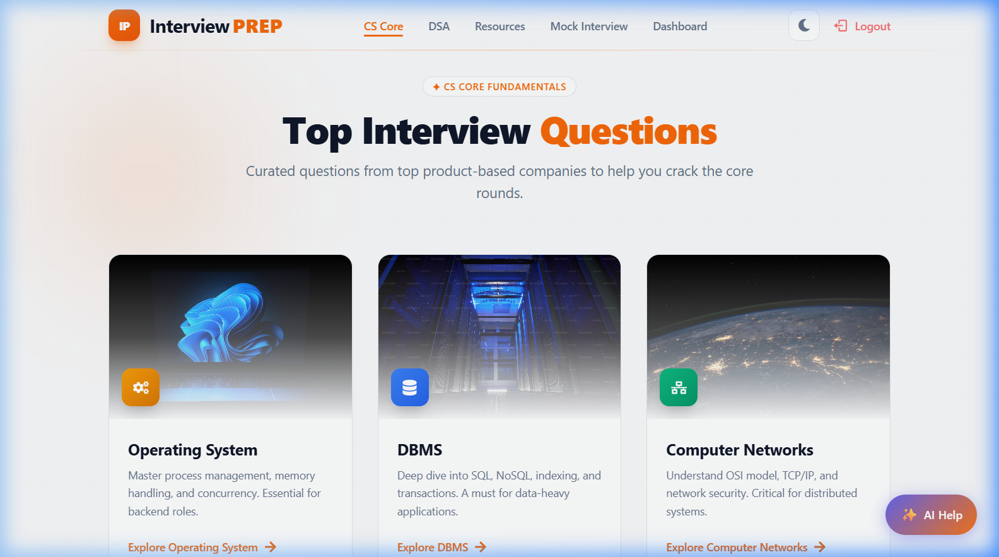
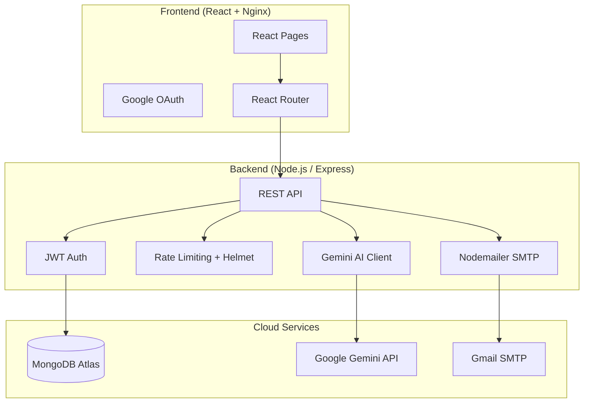

# 🎯 InterviewPrep Platform

[](https://interviewprep-frontend-slr4.onrender.com)
[](https://opensource.org/licenses/MIT)
[](https://reactjs.org/)
[](https://nodejs.org/)
[](https://www.mongodb.com/atlas)
[](https://www.docker.com/)

> **An AI-powered, full-stack interview preparation platform** with adaptive mock interviews, real-time scoring, DSA roadmap tracking, and CS core subject coverage — all in one place.

🌐 **Live at**: [https://interviewprep-frontend-slr4.onrender.com](https://interviewprep-frontend-slr4.onrender.com)

---

## ✨ Features

| Feature | Description |
|---|---|
| 🤖 **AI Mock Interviews** | Gemini-powered adaptive interviewer with per-answer scoring, ideal answers, and session summary |
| 📊 **Dashboard Analytics** | Score trends, topic breakdowns, and session history at a glance |
| 🗺️ **DSA Roadmap** | 143 curated problems with difficulty ratings and progress tracking |
| 📚 **CS Core Subjects** | DSA, DBMS, OS, OOP, SQL, CN — top interview questions with answers |
| 🔐 **Auth System** | JWT + Google OAuth login, rate limiting, password reset via email |
| 🤖 **AI Assistant** | Persistent chatbot for quick interview concept explanations |
| 🐳 **Docker Ready** | Production-grade containers with healthchecks and non-root security |

---

## 📸 Screenshots

### 🏠 Home Page


### 🔐 Login


### 🎤 Mock Interview Setup


### 🗺️ DSA Roadmap


### 📚 CS Core Subjects


---

## 🏗️ Architecture



---

## 🛠️ Tech Stack

**Frontend**: React 18, React Router, Google OAuth (`@react-oauth/google`), Vanilla CSS

**Backend**: Node.js, Express.js, Mongoose, JWT, bcryptjs, Nodemailer, Helmet, express-rate-limit

**Database**: MongoDB Atlas

**AI**: Google Gemini API (`gemini-flash-latest`)

**DevOps**: Docker, Docker Compose, Nginx, Render

---

## 📂 Project Structure

```
Interview-Prep/
├── InterviewPrep-Frontend/
│   ├── src/
│   │   ├── components/         # Nav, Footer, ProtectedRoute, AIAssistant
│   │   ├── pages/              # Dashboard, MockInterview, DSARoadmap, etc.
│   │   ├── hooks/              # useSpeech, custom hooks
│   │   └── config/api.js       # Centralised API base URL
│   ├── Dockerfile              # Multi-stage: React build → Nginx serve
│   ├── Dockerfile.dev          # Dev: CRA hot-reload server
│   └── nginx.conf              # SPA routing config
│
├── InterviewPrep-Backend/
│   ├── src/
│   │   ├── controllers/        # auth, mockInterview, dashboard, AI
│   │   ├── models/             # User, InterviewSession, Document
│   │   ├── routes/             # All Express route definitions
│   │   ├── middleware/         # authMiddleware, security (Helmet + rate limit)
│   │   └── utils/              # geminiClient (with fallback)
│   ├── index.js                # Server entry point
│   └── Dockerfile              # Production: non-root node user
│
├── docker-compose.yml          # Production: both services + healthchecks
├── docker-compose.dev.yml      # Dev: hot-reload with volume mounts
├── docker-compose.mongo.yml    # Offline: local MongoDB container
└── render.yaml                 # Render Blueprint: one-click cloud deploy
```

---

## 🚀 Getting Started

### Option 1: Docker (Recommended)

```bash
# Clone the repo
git clone https://github.com/git-dev-crs/Interview-Prep.git
cd Interview-Prep/Interview-Prep

# Start both frontend + backend
docker compose up --build
```

- 🌐 Frontend: http://localhost:3000
- ⚙️ Backend: http://localhost:3001

### Option 2: Manual Setup

**Backend**
```bash
cd Interview-Prep/InterviewPrep-Backend
npm install
# copy .env.example → .env and fill in your values
cp .env.example .env
npm run dev
```

**Frontend**
```bash
cd Interview-Prep/InterviewPrep-Frontend
npm install
npm start
```

---

## 🐳 Docker Commands

| Command | Description |
|---|---|
| `docker compose up --build` | Build & start production containers |
| `docker compose up -d` | Start in background (detached) |
| `docker compose down` | Stop & remove containers |
| `docker compose logs -f` | Stream live logs |
| `docker compose -f docker-compose.yml -f docker-compose.dev.yml up` | Hot-reload dev mode |

---

## 🔑 Environment Variables

Copy `Interview-Prep/InterviewPrep-Backend/.env.example` to `.env` and fill in:

| Variable | Description |
|---|---|
| `MONGO_URI` | MongoDB Atlas connection string |
| `JWT_SECRET` | Random 32-char secret for JWT signing |
| `GEMINI_API_KEY` | Google Gemini API key |
| `GOOGLE_CLIENT_ID` | Google OAuth client ID |
| `CLIENT_URL` | Frontend origin (for CORS) |
| `SMTP_*` | Gmail SMTP credentials for password reset emails |

---

## 🌐 Deployment

This project is deployed on **Render** using the included `render.yaml` Blueprint.

| Service | URL |
|---|---|
| Frontend | https://interviewprep-frontend-slr4.onrender.com |
| Backend | https://interviewprep-backend-rt48.onrender.com |

---

## 🤝 Contributing

1. Fork the Project
2. Create your Feature Branch (`git checkout -b feature/AmazingFeature`)
3. Commit your Changes (`git commit -m 'Add some AmazingFeature'`)
4. Push to the Branch (`git push origin feature/AmazingFeature`)
5. Open a Pull Request

---

<p align="center">Built with ❤️ for interview preparation</p>
